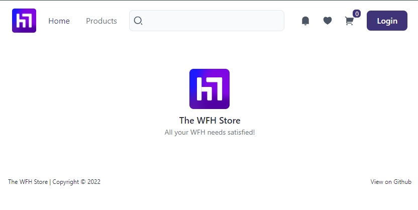

# wfh-goods-store

> WFH (Working From Home) Goods eCommerce Store Website built with `Angular` + `NestJS`

## Overview





A simple e-commerce application that is built using `Angular`, `NestJS` and `MongoDB`. Built as part of the MongoDB Atlas

## Tech Stack


## Getting started

    The application is a monorepo and so both the front-end and the back-end code are in the same repo.

1. **Install dependencies**

```bash
$ npm install
```

2. **Setup the environment variables required for the API**

```yaml
MONGODB_URI=
AUTH0_AUDIENCE=
AUTH0_ISSUER_URL=
AUTH0_DB=

# Used for setting and internal APIs
INTERNAL_TOKEN=
```

3. **Run the Front-end**

```bash
$ npm start
```

4. **Run the Back-end**

```bash
$ npm start api
```

5. **Open the URL in the browser**

Visit http://localhost:4200

---

&copy; 2024 @codeguru827

All rights reserved.
